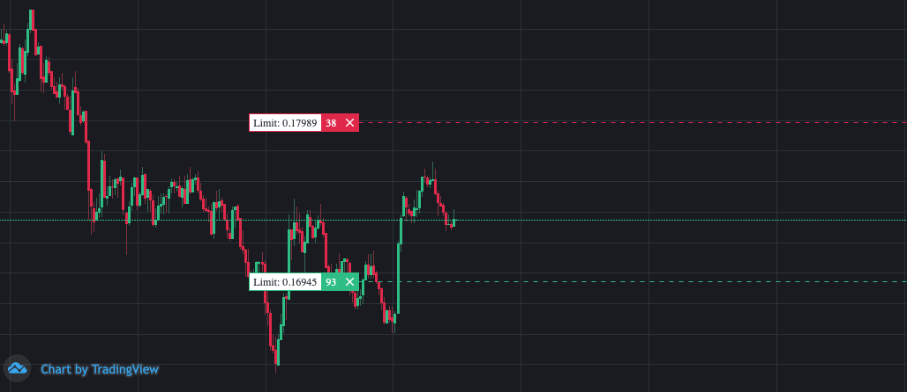
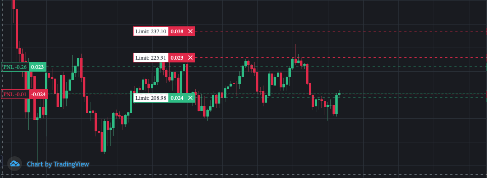

# Configuration

In order to configure Passivbot, you will need to provide a json file when starting the bot.
These config files are typically stored in the `config/live`.

!!! Info
    The configuration of telegram is not covered in this chapter. Please refer to [Telegram](telegram.md) for configuring Telegram.

##Configuration options

In the configuration file provided to run live, the parameters mentioned in the table can be set.
The configuration is split in 4 categories for clarity (user, initial entry, reentry, taking profit, stoploss).
A more detailed explanation on each configuration option is given later on in this chapter.

It's important to realize that most of the configuration is split across a configuration for short positions and long positions.
Configuration parameters that this applies to, are prepended with `short§long:` in the configuration table below.

!!! Info
    The config file can be quite overwhelming when looking at it for the first time. You can have a look at
    the configuration files provided in the repository by default to get a feel for config files.

| Parameter               | Description
| ---------------------   | ------------- |
| `config_name`           | A user-defined identification of the file<br/>**Category:** User<br/>**Datatype:** String 
| `logging_level`         | Indication if logging is to be written to file<br/>**0**: Don't write to logfile<br/>**1**: Write to logfile<br/>**Category:** User<br/>**Datatype:** Integer
| `short§long:enabled`    | Enables/disables the applicable position side<br/>**Category:** User<br/>**Datatype:** Boolean
| `allow_sharing_wallet`  | Indicates if the bot is allowed to start when a position already exists on another symbol<br/>**Category:** User<br/>**Datatype:** Boolean
| `last_price_diff_limit` | Determines until what price the orders are calculated up front<br/>**Category:** User<br/>**Datatype:** Float
| `n_spans`               | Number of spans used to determine initial entry<br/>**Category:** Initial entry<br/>**Datatype:** Integer
| `max_spans`             | Maximum number of ticks used in MA spans<br/>**Category:** Initial entry<br/>**Datatype:** Float
| `min_spans`             | Minimum number of ticks used in MA spans<br/>**Category:** Initial entry<br/>**Datatype:** Float
| `short§long:pbr_limit`  | Position cost to balance ratio limit<br/>**Category:** Initial entry<br/>**Datatype:** Float
| `short§long:iprc_MAr_coeffs` | Initial price Mean Average coefficients<br/>**Category:** Initial entry<br/>**Datatype:** [[Float,Float]..]
| `short§long:iprc_const` | Initial price constant<br/>**Category:** Initial entry<br/>**Datatype:** Float
| `short§long:iqty_const` | Initial quantity percentage of balance<br/>**Category:** Initial entry<br/>**Datatype:** Float
| `short§long:iqty_MAr_coeffs` | Initial quantity Mean Average coefficients<br/>**Category:** Initial entry<br/>**Datatype:** [[Float, Float]..]
| `short§long:rprc_const` | Reentry price constant<br/>**Category:** Reentry<br/>**Datatype:** Float
| `short§long:rqty_const` | Reentry quantity constant<br/>**Category:** Reentry<br/>**Datatype:** Float
| `short§long:rprc_PBr_coeffs` | Reentry position cost to balance ratio coefficients<br/>**Category:** Reentry<br/>**Datatype:** [[Float, Float]..]
| `short§long:rqty_MAr_coeffs` | Reentry quantity Mean Average coefficients<br/>**Category:** Reentry<br/>**Datatype:** [[Float, Float]..]
| `short§long:rprc_MAr_coeffs` | Reentry price Mean Average coefficients<br/>**Category:** Reentry<br/>**Datatype:** [[Float, Float]..]
| `short§long:markup_const` | Profit markup constant<br/>**Category:** Taking profit<br/>**Datatype:** <br/>**Datatype:** Float
| `short§long:markup_MAr_coeffs` | Markup Mean Average coefficients<br/>**Category:** Taking profit<br/>**Datatype:** [[Float, Float]..]
| `short§long:pbr_stop_loss` | Position cost to balance ratio stoploss<br/>**Category:** Stoploss<br/>**Datatype:** <br/>**Datatype:** Float
| `profit_trans_pct`      | Percentage indicating how much profit should be transferred to Spot wallet on each order filled<br/>**Category:** Closing<br/>**Datatype:** Float

## Initial trade entry

Once the bot has started, it will start to create limit orders to enter a position. Depending on whether you have long and/or short enabled
it will create limit orders for either side. The bot relies uses Exponential Moving Averages to calculate the entry points and stoplosses.
When you look at a chart with the initial entry orders, the chart will typically look like this:



What you see on the chart are two limit orders: one above the current price for entering a short position, and the other below
the current price for entering a long position.

The price of the first limit order is calculated as follows:

```python
long = lower_EMA_band * iprc_const
short = upper_EMA_band * iprc_const
```

The EMA upper and lower band (depending on short or long) are calculated by taking the minimum and maximum value of the different EMAs.
The bot calculates EMA based on raw trades (also referred to as ticks) using the following formula:

```python
ema = prev_ema * (1 - alpha) + tick_price * alpha

alpha = 2 / (span + 1)
```

The fastest EMA is defined by the configuration parameters `min_spans`, while the slowest EMA is defined by the configuration parameter `max_spans`.
The configuration parameters `n_spans` defines the number of spans used in the calculation.

An example of the entry price for a short limit order for initial entry:

```gherkin
Given that the iprc_const is 1.005
And that the EMAs are [33.4, 32.1, 32.9]
Then the initial entry price is calculated as 33.4 * 1.005 = 33.567
```

The size of the inital entry order is calculated as follows:

```python
balance_in_terms_of_contracts * iqty_const
```

An example of the entry size for a short limit order for initial entry:

```gherkin
Given that the iqty_const is 0.03
And that the balance is $200
Then the initial entry will is calculated as $200 * 0.03 = $6
```

The configuration parameters `MAr_coeffs` can modify how the ratio between the EMA spans are calculated.
This can be disabled by setting these configuration parameters to 0.0.  

## Reentry

Once the bot is in a position, it will calculate a potential next reentry on the same position side. This allows the bot
to keep the closing price close to the reentry price, allowing it to (if all goes well) close the position in profit without
requiring the price to retract to the initial entry price for making profit. In order to so, the reentries will be bigger
in quantity on each reentry in order to compensate for the existing position.
As long as there is sufficient balance, the bot will keep creating reentry orders based on the previous reentry order until
the allowed balance is spent. A chart with a position on both sides will tyically look like this:



On the chart you can see there are currently two positions open (the two PNL lines are an indication of this, which indicate
the entry price). Right beyond those PNL lines are the limit orders for taking profit. In the chart you see above, there is
also another limit order at the top, which is the first reentry order for the short position.

!!! Info
    Depending on your configuration, you may not (yet) see all possible reentries. The bot will only create the orders that are
    within 15% of the current price. This way, the bot can avoid running into rate limit issues. If you want to see more reentry
    orders that are further away, you can set the configuration parameter `last_price_diff_limit` to a value between 0 and 1 (1
    being 100%)

The next reentry price is calculated using the following formula:

```python
long = min(initial long entry price, long position price * long§rprc_const)
short = max(initial short entry price, short position price * short§rprc_const)
```

Apart from using the above formula to calculate the next reentry price, the `long§rprc_PBR_coeffs` parameters are used
to modify the grid space in proportion to the position size.

The ratio of position cost to balance times PBr_coeffs is added to rprc_const. An example of how this influences the reentry price:

```gherkin
Given that the current position size is 0.23
And that the position price is 250.0
And that the balance is $80.0
Then the position cost is 0.23 * 250.0 = 57.5
And position cost to balance ratio is 57.5 / 80 = 0.71875
```

In order to determine the reentry price modificatier, the following formula is used:

```python
Reentry price modified = position cost to balance ratio ** 2 * PBr_coeffs[0] + position cost to balance ratio * PBr_coeffs[1]
```

Let's look at an example on calculating the next reentry for a long position to illustrate this:

```gherkin
Given that the reentry price constant is 0.98
And the PBr_coeffs is [-0.05, 0.01]
Then the reentry price is rprc_const + 0.71875**2 * -0.05 + 0.71875 * 0.01 == 0.98 + -0.018642578125000003 == 0.961357421875
And the next reentry will be ~3.86% instead of 2.0% lower than long position entry price.
```

The next reentry quantity is calculated using the following formula:

```python
order_size = initial entry quantity + position size * short§rqty_const
```

!!! Info
    When reentry limit orders are calculated, any reentry order that makes the position cost higher than `pbr_limit + pbr_stoploss` is not created.

## Closing trades

Once a position is opened, it can either be closed when it is in profit, or get into a stoploss position. Both situations are
described in the following sections.

### Taking profit

Once the position reaches a predefined price, it will be closed, resulting in profit to be taken. The closing order for
this is calculated up front. The price at which the entire position will be closed is calculated using the following formula:

```python
closing_price = position_price * markup_const
```

As you can see in the formula, increasing the `markup_const` will increase the profit. Be aware that the price will also
need to move further to reach that price though!

### Stoploss

When Passivbot is in a position, it has a notion of the position cost for the current position.
When the position cost is greater than the specified `pbr_limit + pbr_stoploss`, Passivbot will partially close the open
position to bring the position cost back to this specified limit. By doing so, the bot ensures that the position cost
will never be greater than `pbr_limit + pbr_stoploss`.

## Logging

When running, Passivbot writes information to the console by default. It is possible to have the bot write this information
to a log file for easier access and to allow looking up information historically. This information includes orders being created, cancelled, positions and open orders. 

If the configuration parameter `logging_level` is set to `0`, the aforementioned information will **not** be written to a logfile.
If the parameter is set to `1`, the information **will** be written to a logfile.

If writing the logs to a file is enabled, the information is stored in a file at `logs/{exchange}/{config_name}.log`.
The config_name is the value that is specified in the `config_name` parameter in the configuration file.

!!! Warning
    Be aware that Windows can have a limitation on the maximum path length of a file. If you run into a problem with this,
    you can try moving Passivbot to a different location that results in a shorter pathname, or a shorter value in the `config_name` parameter.

## Automatic profit transfer

Passivbot provides functionality to automatically transfer a specified percentage of profit on closed trades to the spot wallet.
The transfer is performed in USDT, and the percentage transferred is defined by the `profit_trans_pct` configuration parameter.

Besides automatic profit transfer, you can also manually transfer funds between your spot and futures wallet using Telegram.
You can read more on this functionality in the [Telegram](telegram.md) section.

!!! Info
    In order to use this functionality, make sure you enable `Universal Transfer` on your API key.<br/>
    This functionality is currently only supported on **Binance**
