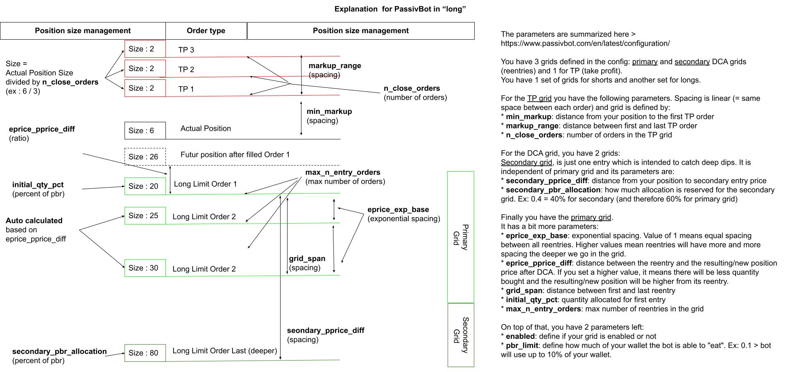

# Configuration

In order to configure Passivbot, you will need to provide a json file when starting the bot.
These config files are typically stored in the `configs/live`.

## Configuration options

Long and short positions are supported and have each the same parameters.

**Static grid mode**
| Parameter                  | Description
| -------------------------- | ------------- |
| `enabled`                  | Set to false and bot continue as normal, but not make new positions once previous positions have been closed.
| `wallet_exposure_limit`                | Position cost to balance ratio limit.
| `eprice_exp_base`          | Set to 1.0 and each node in the entry grid will be equally spaced.  Any value > 1 and nodes will have wider spacing deeper in the grid.
| `eprice_pprice_diff`       | Per uno difference between entry price and resulting pos price.  Higher values means lower qtys per node
| `grid_span`                | Per uno span from initial entry to last node in primary grid.
| `initial_qty_pct`          | Initial entry qty = `balance_in_terms_of_contracts * wallet_exposure_limit * initial_qty_pct`
| `min_markup`               | Distance from pos price to first Take-Profit order
| `markup_range`             | Distance from first Take-Profit order to last Take-Profit order.
| `max_n_entry_orders`       | Max number of nodes in entry grid.
| `n_close_orders`           | Max number of nodes in Take-Profit grid.
| `secondary_pprice_diff`    | Distance from pos price to secondary entry price. 
| `secondary_allocation` | Allocation of wallet_exposure_limit for secondary entry.  E.g. 0.4 means 40% to secondary, 60% to primary.

Secondary entry is independent of primary entry grid, intended to catch abnormally deep dips.

Here is a diagram summarizing the parameters (without EMA):

[Full image](images/passivbot_grid_parameters.jpeg)

**Recursive grid mode**

See `docs/passivbot_modes.md`

**EMAs**

Since Passivbot 5.3, EMA are introduced to allow:
* limit initial entries at peak of pump/dump
* auto unstuck position
The mechanism is described in this chapter : (https://github.com/enarjord/passivbot/blob/master/docs/auto_unstuck.md)

**Backwards TP**

Since passivbot v5.6 parameter "backwards_tp: true/false" is added.

The backwards tp mode works like this:

(considering long pos, short pos is same but flipped)

1) get close prices evenly spaced `linspace(pprice * (1 + min_markup), pprice * (1 + min_markup + markup_range), n_close_orders)` e.g. pprice=100, min_markup=0.002, markup_range=0.018, n_close_orders=10 -> `[100.2, 100.4, 100.6, 100.8, 101.0, 101.2, 101.4, 101.6, 101.8, 102.0]`

2) filter out prices lower than current lowest ask

3) calc full psize, i.e. psize when wallet_exposure==wallet_exposure_limit: `full_psize = (wallet_exposure_limit * balance) / pprice` (linear)

4) calc qty per close: `qty_per_close = max(min_qty, round_up(full_psize / len(close_prices), qty_step))`

5) for each TP node backwards, add qty until psize is spent

Say full_psize=10 and actual psize is 3. qty per close is 10 / 10 == 1.  
Given TP prices `[100.2, 100.4, 100.6, 100.8, 101.0, 101.2, 101.4, 101.6, 101.8, 102.0]`,  
fill them up starting backwards: `[1@102.0, 1@101.8, 1@101.6]`,  
break when sum(qtys) == psize

Say full_psize=20 and actual psize is 15. qty per close is 20 / 10 == 2.  
Given TP prices `[100.2, 100.4, 100.6, 100.8, 101.0, 101.2, 101.4, 101.6, 101.8, 102.0]`,  
fill them up starting backwards: `[2@102.0, 2@101.8, 2@101.6, 2@101.4, 2@101.2, 2@101.0, 2@100.8, 1@100.6]`,  
break when sum(qtys) == psize
