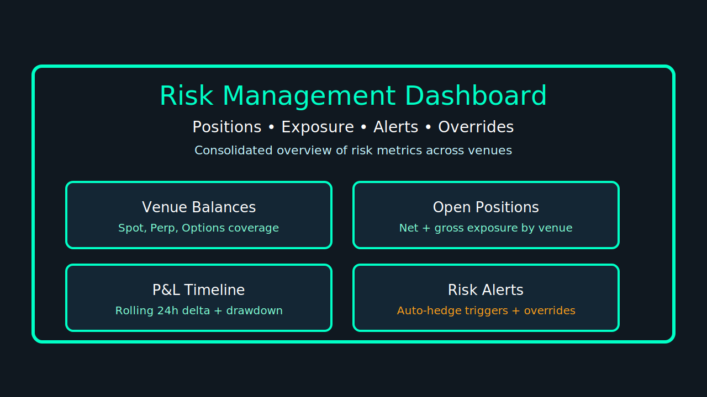

# Risk Management Refactor Summary

## Overview
The risk-management refactor unifies live risk telemetry, alerting, and governance controls across venues. This document summarizes the architectural updates, API surface changes, and user interface improvements that ship with the consolidated dashboard experience.

## Architectural Changes
- **Event-driven core** – A dedicated `risk_orchestrator` service now consumes normalized position, order, and balance events from venue adapters via a Kafka topic mesh, replacing per-exchange polling.
- **State cache** – Shared Redis-backed state for exposure, margin utilization, and threshold overrides enables deterministic kill-switch enforcement across CLI, REST, and UI consumers.
- **Policy engine** – New rule evaluation layer groups policies by desk, so overrides can be scoped to venue clusters while retaining portfolio-level alerting semantics.
- **Observability** – Structured tracing (OpenTelemetry) and metric emission (Prometheus) were added for risk rule evaluation, kill-switch activation, and alert delivery to improve operations visibility.

## New API Endpoints
| Method | Endpoint | Description |
| --- | --- | --- |
| `GET` | `/api/risk/v2/positions/summary` | Aggregated exposure snapshot by venue, instrument type, and hedge pair.
| `POST` | `/api/risk/v2/kill-switch/trigger` | Triggers the orchestrated kill-switch and returns the broadcast status per venue adapter.
| `PATCH` | `/api/risk/v2/thresholds/{desk}` | Applies stop-loss and drawdown overrides scoped to a trading desk.
| `GET` | `/api/risk/v2/analytics/pnl` | Streams rolling P&amp;L deltas and drawdown metrics used in the dashboard timeline widget.
| `GET` | `/api/risk/v2/analytics/alerts` | Returns historical alert firehose data, including auto-hedge responses and manual acknowledgements.

## UI Adjustments
- **Consolidated dashboard landing page** combines positions, exposure, alerts, and overrides in a single canvas, removing the need to tab through multiple panels.
- **Kill-switch banner** now surfaces the live activation state with per-venue acknowledgements and links back to CLI triggers.
- **Threshold editor** allows inline adjustments to stop-loss bands with validation against policy guardrails before publishing to the orchestrator.
- **Analytics tray** adds stacked sparkline widgets for drawdown, realized P&amp;L, and alert cadence with streaming updates.

## Migration Guidance
1. Update deployment manifests to include the `risk_orchestrator` service and Redis dependency.
2. Grant the dashboard service access to the new `/api/risk/v2/*` endpoints; legacy `/api/risk/v1/*` routes remain available for one release as read-only fallbacks.
3. Rotate CLI automation scripts to target the kill-switch trigger endpoint and confirm they subscribe to the `risk.kill-switch.broadcast` Kafka topic for acknowledgements.
4. Verify Prometheus scrapes the new `risk_policy_*` metrics to populate the updated Grafana dashboards.

## Rollout Considerations
- Stagger rollout starting with sandbox venues; enable full production kill-switch propagation only after the regression checklist passes.
- Communicate UI/UX changes to portfolio managers via the CHANGELOG and release notes so they are aware of the consolidated dashboard workflow.
